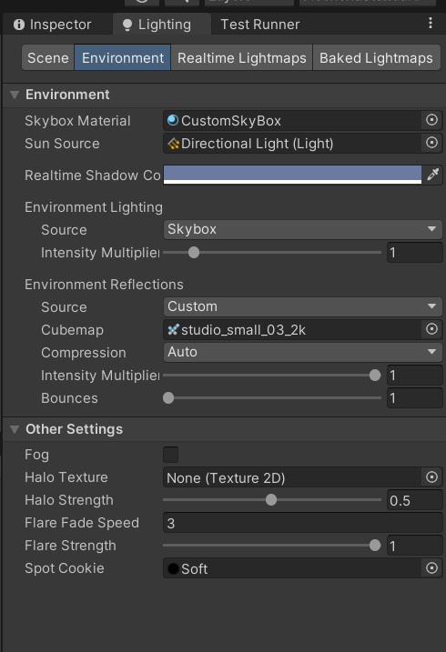
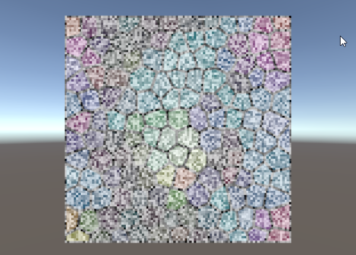
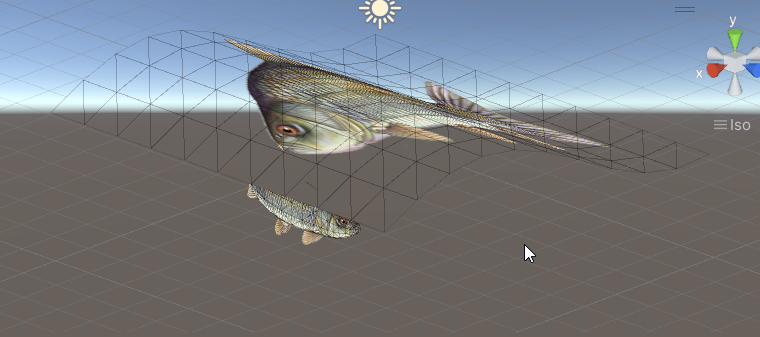

# Unity Shader Test

### Repository for Unity shader example

These are examples of various Unity shaders, coming from different sources (ShaderToy, Unity websites, tutorial, youtube videos and so on). It's basically learning material to explore how shaders work, not to use in production. They are developed and tested only with Unity Standard Rendering Pipeline.

Personally I would like to give a big thanks to all the people that make available all the material that anyone can use to learn something new every day. Frankly, I don't know how I could learn all this stuff without these examples.

Shaderes are collected inside the path Flecheria/.../... etc.

Open to questions, knowledge and contributions.

### Notes

Remember for reflection inside DevelopmentBasic scene to setup the default CubeMap for Environment Reflections:

### References

(not in particular order, you can find others within the code)

Unity (of course):

[ShaderToy]((https://www.shadertoy.com/)) of course, of course.

[GLSL Sandbox](http://glslsandbox.com/) (of course, of course and of course. This is great for beginner, ShaderToy needs some technical capabilities).

[Shader Development from Scratch for Unity with Cg (Udemy)](https://www.udemy.com/course/unity-shaders/). ery good course if you want to learn about shaders and graphics pipeline in Unity.

Articles:

- http://thomsonteguh.com/wireframe-shader/
- https://github.com/Scrawk/Wireframe-Shader
- https://unitylist.com/p/a38/Unity-Shader-Practice-Lab
- https://answers.unity.com/questions/1174716/gradient-glow-shader.html

[How to convert a shader from ShaderToy to Unity](https://www.youtube.com/watch?v=CzORVWFvZ28)

[Writing a ray marcher in Unity](https://www.youtube.com/watch?v=S8AWd66hoCo)

### Final Result

Noises

Fish Moving

### Unity ShaderNodes Tutorial

### Tutorial

[Noise Generation Algorithms](https://www.bitshiftprogrammer.com/2018/01/noise-generation-algorithms-white-noise.html)  
[Ronya Tutorial](https://www.ronja-tutorials.com/)  
[Article 1](http://thomsonteguh.com/wireframe-shader/)  
[Article 2](https://github.com/Scrawk/Wireframe-Shader)  
[Article 3](https://unitylist.com/p/a38/Unity-Shader-Practice-Lab)  
[Article 4](https://answers.unity.com/questions/1174716/gradient-glow-shader.html)  
[Video tutorial 1](https://youtu.be/qDk-WIOYUSY)  
[Video Tutorial 2](https://youtu.be/4AVc2YkOGtA)  
[Video Tutorial 3](https://youtu.be/BrZ4pWwkpto)  
[CatWalking Compute Shader tutorial](https://catlikecoding.com/unity/tutorials/basics/compute-shaders/)  
  
  
  
  
  
  
  
  

### License

MIT License (see License.txt)